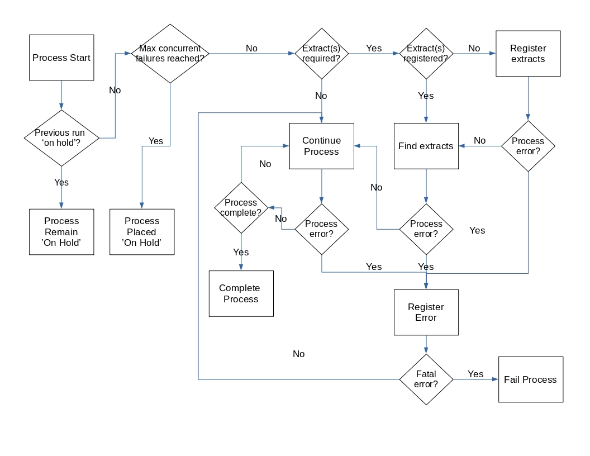

ProcessTracker Workflow
#######################

ProcessTracker is designed to have a standardized (yet simple) workflow that all implementations must follow, regardless
if the implementation is language or tool specific.

This page will now describe the steps in the workflow above.  Examples of the steps are provided in the individual
implementation sections, so that users can view examples with the implementation they are using.

Process Start
=============
When a process run (the instance of a process processing) is first kicking off, it must be registered in the
ProcessTracker data store.  This includes information such as:

.. list-table:: process registration entities
   :widths: 25 25
   :header-rows: 1

   * - Entity Name
     - Entity Description
   * - process_name
     - The unique name of the process
   * - process_type
     - The overall type of process the process is.  For instance, if the process is only extracting data it could be
       classified as of type 'Extract'.
   * - actor_name
     - The person or thing that initiated the process
   * - tool_name
     - The type of tool used in this process.  For instance, Spark, Talend, Pentaho, DataStage, etc.
   * - sources
     - A single name or list of names of source systems being used in this process.
   * - targets
     - A single name or list of names of target systems being used in this process.  These are stored as sources since
       a source can be a target, and a target can be a source.

These entities are described in more detail in the :doc:`Model <./model/model>` section.

Once the process run is registered, it must be determined with extract file(s) are required for further processing.

Previous run 'on hold'?
=======================

If the process has failed enough times, then the process should no longer try to process regardless of how many times
it has triggered.  This status is termed 'on hold'.  If the previous run of a process has hit the max_concurrent_failures
setting value, then the run will be placed on hold.  The process will remain in that status until manually switched over
to 'completed' or another status that is not 'running' or 'failed'.

Max concurrent failures reached?
================================

If the previous run is not in the 'on hold' status, then a number of previous process runs matching the
max_concurrent_failures will be checked.  If those runs are all failures (matching the max_concurrent_failures value)
the current run will be placed 'on hold' until the failure is resolved.  Otherwise the process run will proceed as normal.

Extract(s) required?
====================

Sometimes processes are not straight through from source to target.  This is where extracts come into play.  An extract
is basically a data dump that acts as a intermediary between processes.  Extracts can be one time use, reusable, or just
available within a single process run - it's really up to how you want to leverage the framework.  If extracts are
required then they must be registered into the ProcessTracker data store.  If they are not required, then the process
can continue running.

Extract(s) registered?
======================

A process run does not have to necessarily register files independently of other processes.  The files may have been
created beforehand by another process.  If the process is not creating files, then it can find the files by location
and filename.  Otherwise, if files are being created by the process run, the extracts must be registered.

Register extracts
=================

Similar to how processes/process runs must be registered in the ProcessTracker data store, extract files must as well.
Registration includes data such as:

.. list-table:: extract registration entities
   :widths: 25 25
   :header-rows: 1

   * - Entity Name
     - Entity Description
   * - process_run
     - The process run that's working with the extract file.
   * - filename
     - The name of the file.  Should not include the file path.
   * - location
     - The file path where the file is located.
   * - status
     - By default the status is set to 'initialized'.

These entities are described in more detail in the :doc:`Model <./model/model>` section.

Find extracts
=============

If the extract files have already been registered, then they can be located by filename and location.  Once found they
can be used by the process run to continue processing, provided the location is still accessible to the process.

Continue process
================

If all goes well, then the process can continue to run.  Otherwise, the error tracking system can be utilized. As
extracts are finished being used, their status should be changed to reflect where they are in the process.  This can
either be done all at once or individually, depending on how fault tolerant the process being run is.

Register error
==============

Any errors triggered during the process run can be registered in ProcessTracker's data store.  These can range from
system errors, process errors, data errors, etc.  There is no proscription to what can be tracked error-wise.  That said,
there are some errors that just can't be tracked.  For instance, if your process run runs out of memory then things may
go seriously bork, to the point that the system can't actually record the error or continue running.

Fatal error?
============

Many error classes are bad enough to prompt the process run to come to an end.  If that is the case, the process run
must also be put in a failed status along with any errors that need to be recorded.

Fail Process
============

If the process needs to fail, then the status of the process run should be changed to 'failed'.

Process complete?
=================

If all processing for the process run successfully completed, then the status of the process run can be changed to
'complete'.
